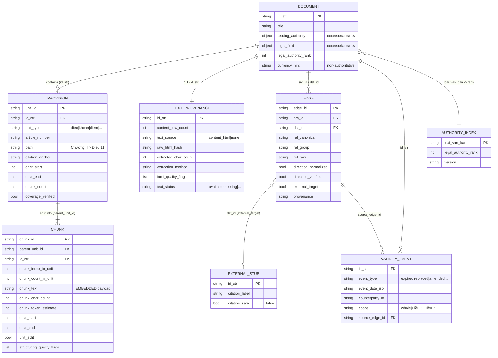
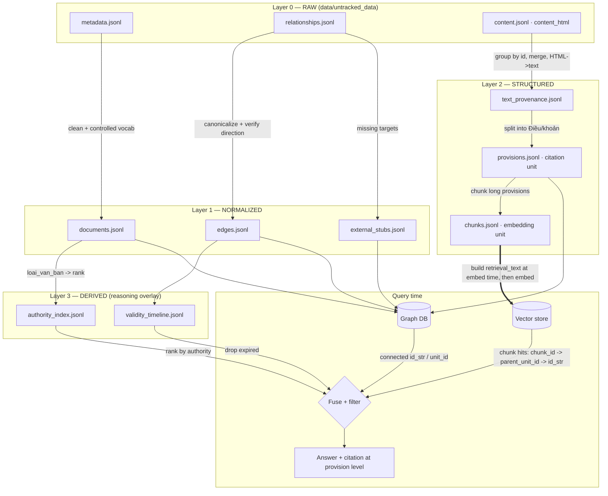

# Dataset_SPEC_v2 (Proposal) — Legal-Retrieval-First Dataset Strategy for G-LRAG

| Field | Value |
| --- | --- |
| Status | **Proposal / alternative** — does not replace `Dataset_SPEC.md` until approved |
| Version | 2.0-draft |
| Author | Dataset preprocessing owner |
| Date | 2026-07-06 |
| Scope | Dataset layer for Hybrid RAG **and** GraphRAG, per `SPEC.md` §4–§6 |
| Relationship to current spec | Keeps the parts of `Dataset_SPEC.md` that work (quarantine, stubs, reconciliation) and redesigns the parts that are weak for *legal* retrieval (validity, authority, text, temporal reasoning) |
| Data grounding | Revised after inspecting `data/untracked_data/` — the raw inputs `metadata.jsonl`, `relationships.jsonl`, **and `content.jsonl`** |

> **Revision note (2026-07-06).** An earlier draft assumed document body text was missing. It is not. `data/untracked_data/content.jsonl` provides `content_html` for the corpus. Measured facts (see §4.0) now drive the text strategy in §4, the acceptance criteria in §10, and the migration order in §11.

---

## 1. Why a different strategy

The current `Dataset_SPEC.md` is a good **data-cleaning** spec. This proposal reframes it as a **legal-retrieval** spec. The difference drives every design choice below.

The current strategy optimizes: *is this record clean, valid JSON with normalized fields?*

A legal RAG + GraphRAG system also needs the dataset to answer: *is this the currently-binding law, from a sufficiently authoritative source, and can I trace and cite the exact clause that grounds my answer, including how it changed over time?*

Five design shifts follow from that:

| # | Current strategy | Proposed strategy | Why it matters for law |
| --- | --- | --- | --- |
| D1 | `content.jsonl` exists but is unused by the finalized package; text left undefined for downstream | **Promote `content.jsonl` to a first-class dataset artifact**: parse HTML, join by `id`, track provenance and coverage | Legal answers must ground in clause text, not titles |
| D2 | `validity_group` is a frozen label | **Validity is derived at query time** from edges + dates; stored label is only a hint | Legal validity is temporal and partial; a frozen label rots |
| D3 | `dataset_tier` mixes authority and currency | **Split into `legal_authority_rank` (hierarchy) + `currency_status` (time)** | Legal precedence (Hiến pháp > Luật > …) is first-class |
| D4 | `*_canonical` = cleaned strings | **Controlled vocabularies** with ID + surface form | Faceted legal search ("MoF Circulars on tax") must not fragment |
| D5 | Edges ingested, direction unverified | **Direction is verified and normalized** to a canonical semantic direction | "X replaces Y" backwards is a correctness failure |

Everything worth keeping from v1 is kept (see §9).

---

## 2. Design principles

1. **Ground truth is the provision, not the document — and the chunk, not the provision, is what gets embedded.** The atomic *citable* unit is a legal provision (Điều/article); the atomic *retrievable/embedding* unit is a chunk of that provision. Provisions are often long, so each is split into one or more chunks (Điều 11 → chunk #1, #2, …). The dataset must make both clause-level citation and chunk-level retrieval possible, and must link every chunk back to its parent provision.
2. **Time is a dimension, not a status.** Every validity/authority statement is "as of date D." The dataset stores the inputs to compute validity at any D, not a single snapshot.
3. **Authority is explicit.** Legal precedence is encoded as a rank the ranker can use directly, independent of currency.
4. **Every kept fact is traceable and reversible.** Quarantine-not-delete, provenance on every derived field, full reconciliation. (Inherited from v1.)
5. **The graph and the vector store share one identity space.** `id_str` (document), `unit_id` (provision/citation unit), and `chunk_id` (embedding unit) are the join keys everywhere. Every `chunk_id` carries its `parent_unit_id` and `id_str`, so a vector hit resolves to a citable provision and document with no translation, and GraphRAG filters compose directly.
6. **Nothing silent.** Missing text, unverified edge direction, empty filters — all surfaced, never papered over. (Inherited from v1, `SPEC.md` §5.6.)

---

## 3. Dataset layers and artifacts

The dataset is organized as four layers with clear ownership. Layer 0–1 are what v1 already produces (cleaned); Layers 2–3 are the additions that make it legal-retrieval-ready.

```
Layer 0  RAW           metadata.jsonl, relationships.jsonl, content.jsonl (content_html)
Layer 1  NORMALIZED    documents.jsonl, edges.jsonl, external_stubs.jsonl        (clean + controlled vocab)
Layer 2  STRUCTURED    provisions.jsonl (citation unit), chunks.jsonl (embedding unit), text_provenance.jsonl
Layer 3  DERIVED       validity_timeline.jsonl, authority_index.jsonl           (query-time reasoning inputs)
         AUDIT         *_quarantine.jsonl, reconciliation_report.md
```

| Artifact | Layer | Purpose |
| --- | --- | --- |
| `documents.jsonl` | 1 | One record per legal document, normalized, with controlled-vocab fields and authority rank |
| `edges.jsonl` | 1 | Directed, direction-verified relationship edges |
| `external_stubs.jsonl` | 1 | Placeholder nodes for referenced-but-missing targets (kept from v1) |
| `provisions.jsonl` | 2 | Citation units (Điều/article): full clause text, offsets, citation anchor, and `chunk_count`. **Not embedded.** |
| `chunks.jsonl` | 2 | Embedding units: each provision split into one or more chunks (`chunk_id`, `parent_unit_id`, `chunk_text`) — slim join keys only; `retrieval_text` is built at embed time. **This is what the vector store indexes.** |
| `text_provenance.jsonl` | 2 | Per `id_str`: content-row count, HTML hash, extraction method, char count, `text_status` (incl. the 6,563 `missing`) |
| `validity_timeline.jsonl` | 3 | Per-document (and per-provision where known) validity events over time |
| `authority_index.jsonl` | 3 | The document-type → authority-rank mapping, versioned |
| `*_quarantine.jsonl` | Audit | Excluded records with reasons (kept from v1) |
| `reconciliation_report.md` | Audit | Counts, reconciliations, direction sign-off, coverage (kept + extended from v1) |

---

## 4. D1 — Text as a first-class artifact

A legal RAG system cannot ground answers without clause text. v1 doesn't consume it, but the raw text **does exist** — it just needs promoting into the dataset contract.

### 4.0 Measured facts about `content.jsonl` (inspected 2026-07-06)

| Metric | Value | Implication |
| --- | ---: | --- |
| Rows in `content.jsonl` | 178,665 | More rows than documents — text is fragmented |
| Unique `id` values | 149,051 | ~29,614 documents have **multiple** content rows |
| Rows with empty/tiny `content_html` | 0 | Where text exists, it is substantive |
| Metadata `id`s with **no** content row | 6,563 of 153,420 (~4.3%) | A real "missing text" tail to track, not drop |
| Content field | `content_html` (raw HTML, e.g. `<table class="detailcontent">…`) | Requires HTML→text extraction before structuring |
| Join key | `content.id` ↔ `metadata.id` (integer, stringify to `id_str`) | Single, clean join key |

Two facts drive the design:

1. **`content.jsonl` is a 1-to-many source, not 1-to-1.** 178,665 rows vs. 149,051 unique IDs means a document's body can arrive in several rows (multi-part documents, appended attachments/`PHỤ LỤC`, or re-scrapes). The dataset must **group content rows by `id` and order them deterministically** before structuring, or clause offsets and reconstruction will be wrong. This must be resolved at the dataset layer, not silently left to the text-structuring team.
2. **Text is HTML.** `content_html` carries markup (`<table>`, `<div align="justify">`, …). Extraction quality (stripping boilerplate, preserving Điều/khoản boundaries, handling tables) is now a **dataset-owned concern** with its own quality flags, because retrieval grounding quality depends entirely on it.

### 4.1 Text source contract
- The dataset owns a `text_provenance.jsonl` record for **every** metadata `id_str`, even when text is absent — mirroring v1's "track, don't drop" discipline. Directly measurable: the 6,563 no-content IDs get `text_status = missing`.
- Each record:
```text
id_str
content_row_count      # how many content.jsonl rows joined (0 for the 6,563 missing)
text_source            # content_html | none
raw_html_hash          # hash of the concatenated, ordered raw HTML
extracted_char_count   # chars after HTML→text extraction
extraction_method      # parser + version (e.g. "selectolax+cleanrules@1")
html_quality_flags     # e.g. table_heavy, boilerplate_detected, encoding_fixed, multi_row_merged
text_status            # available | missing | empty | too_short | extraction_failed
```
- `content_row_count > 1` triggers the deterministic merge rule (§4.0 fact 1); the merge order and `multi_row_merged` flag are recorded so it is auditable.
- `text_status` is the exact analogue of v1's quarantine reasons, but for text — nothing is dropped, everything is accounted for against the 153,420 metadata total.

### 4.2 Two levels: Provision (citation unit) and Chunk (embedding unit)

**Correction to an earlier draft:** the provision and the embedding unit are **not** the same thing. A provision (Điều/article) is the *legal citation unit* — it's what a lawyer cites and what the graph reasons over. But an article can be long (multiple khoản, tables, lists), often too long to embed as a single high-quality vector. So each provision is **chunked further**, and the **chunk is the embedding/retrieval unit**. This is exactly the `Document → Legal Unit → Chunk` hierarchy the text-structuring team already defined (`SPEC_Text Structuring.md` §4–§6); v2 aligns to it rather than flattening it.

```text
Document ──has many──▶ Provision (Điều 11) ──has many──▶ Chunk (Điều 11 #1, #2, …)
   │                        │                                  │
   id_str                   unit_id                            chunk_id
 legal doc            legal/citation unit                embedding/retrieval unit
```

So Layer 2 emits **two** files, not one:

#### `provisions.jsonl` — the legal/citation unit (one row per Điều/khoản)
```text
unit_id              # {id_str}::dieu::{n}[::khoan::{m}]  — deterministic
id_str               # parent document
unit_type            # dieu | khoan | diem | preamble | attachment | document_fallback
article_number       # Điều number when applicable
path                 # hierarchical: "Chương II > Điều 11"
citation_anchor      # "Luật … số …, Điều 11"
char_start, char_end # offsets into the merged source text
chunk_count          # how many chunks this provision was split into
coverage_verified    # bool — provision text reconciles against source
```
Provisions carry **no embedding** — they are the citation/graph anchor and the parent of chunks. The graph's `Provision` nodes and the citation layer use this file.

#### `chunks.jsonl` — the embedding/retrieval unit (one or more rows per provision)

**Slim by design.** The chunk row carries only join keys and chunk-intrinsic fields — no `retrieval_text`, no denormalized display/authority metadata. Copying that onto every chunk roughly tripled the file (`retrieval_text` alone was ~45% of bytes, and it duplicated `chunk_text`). Instead, `retrieval_text` is **assembled at embed time** from the parent provision (`parent_unit_id` → `provisions.jsonl`) and the document (`id_str` → `documents.jsonl`), so display/citation/authority facts stay authoritative in one place.

```text
chunk_id             # {unit_id}::chunk::{k}   e.g. "…::dieu::11::chunk::2"
parent_unit_id       # the provision (unit_id) this chunk belongs to  → join to provisions.jsonl
id_str               # parent document                               → join to documents.jsonl
chunk_index_in_unit  # 1, 2, 3 … position within the provision
chunk_count_in_unit  # total chunks in the parent provision
chunk_text           # clean chunk text — the embeddable payload (what the LM sees)
chunk_char_count     # length of chunk_text
chunk_token_estimate # estimated tokens
char_start, char_end # offsets within the provision / source
unit_split           # bool — was the parent provision split into multiple chunks
structuring_quality_flags
```

**`retrieval_text` (built at embed time, not stored):** `citation_label` + `citation_anchor` + `[loai_van_ban | rank | validity_group]` header prepended to `chunk_text`. The embedder resolves `parent_unit_id` and `id_str` once and injects this context just before encoding — identical vectors to the old stored form, at ~⅓ the on-disk size.

**Splitting policy** (from `SPEC_Text Structuring.md` §6, adopted as-is): chunk *inside* a provision, never across article boundaries; keep short articles as a single chunk; split long articles by khoản / numbered paragraphs, falling back to ~700–1,000 token windows with ~100–150 token overlap. So your example becomes: `Điều 11 → chunk #1, chunk #2, …`, each a separate embeddable row, all sharing `parent_unit_id = {id_str}::dieu::11`.

**Why the split matters for retrieval:**
- **Embedding quality** — a focused chunk embeds far more precisely than a 3-page article, so similarity search actually finds the relevant passage.
- **Same-unit expansion** — because every chunk carries `parent_unit_id`, when one chunk of Điều 11 is retrieved the system can pull its sibling chunks to restore full-article context before answering (`SPEC_Vector_Retrieval.md` §4.5).
- **Citation stays at the legal level** — even though retrieval hits a chunk, the citation resolves up to the provision (`Điều 11`), which is what a legal answer must cite. Chunk boundaries are an implementation detail the user never sees.

This deliberately reuses the text-structuring team's model rather than inventing a competing one (see §9); v2's only addition is pulling both files into the dataset contract so retrieval and graph share the same `unit_id` / `chunk_id` identity space.

---

## 5. D2 — Validity as derived, not stored

### 5.1 The problem with a stored label
`validity_group = active` is only true as of the preprocessing date. Laws expire and get amended continuously; a frozen label silently becomes wrong, and `partial` erases *which* provisions changed.

### 5.2 The proposal: a validity timeline
`validity_timeline.jsonl` records **events**, not a status:
```text
id_str
event_type      # enacted | effective | expired | replaced | amended | suspended
                # partially_expired | partially_amended | partially_suspended
event_date_iso  # when it takes effect
counterparty_id # the other document (from edges), if any
scope           # "whole" | free-text article scope, e.g. "Điều 5, Điều 7"
source_edge_id  # which edge in edges.jsonl produced this event (provenance)
```
- `currency_status(id_str, as_of_date)` becomes a **function**, computed by folding events up to `as_of_date`. Default `as_of_date = today`.
- The stored `currency_hint` field on `documents.jsonl` is retained **only as a fast-path hint / fallback** when the timeline is incomplete, explicitly labeled non-authoritative.
- Partial changes keep their `scope`, so the system can answer "Điều 5 was repealed but Điều 7 stands" — impossible under v1's single `partial` label.

### 5.3 Why this fits GraphRAG
The timeline is derived from the same relationship edges the graph traverses. Validity reasoning and graph lineage become the *same* operation, not two parallel truths that can disagree.

---

## 6. D3 — Split authority from currency

### 6.1 `legal_authority_rank`
A first-class integer rank derived from document type via the versioned `authority_index.jsonl`:

| Rank | Document types (examples) |
| ---: | --- |
| 1 | `Hiến pháp` |
| 2 | `Bộ luật`, `Luật` |
| 3 | `Pháp lệnh`, `Lệnh` |
| 4 | `Nghị định`, `Nghị quyết` (of Government) |
| 5 | `Quyết định`, `Chỉ thị` (of PM) |
| 6 | `Thông tư`, `Thông tư liên tịch` |
| 7 | `Công văn`, `Thông báo`, and other guidance/administrative |
| 99 | `unknown_type` / unranked |

- Ranking can now prefer *higher-authority* sources independently of recency.
- Conflict resolution ("two documents disagree") can follow legal precedence (`min(rank)` wins, newer breaks ties) — a real legal reasoning rule, encodable because authority is explicit.

### 6.2 `currency_status` (derived, §5) replaces the currency half of `dataset_tier`
`dataset_tier` is retired. The two things it conflated become:
- `legal_authority_rank` — how authoritative (static).
- `currency_status(as_of)` — how current (temporal, derived).

`primary`/`reference` can still be produced as a **convenience view** (`primary = high authority AND currently in force`) for teams that want v1-style simplicity, but it's a derived label, not the source of truth.

---

## 7. D4 — Controlled vocabularies

Each faceted field becomes a `{code, surface, source}` triple instead of a cleaned string:
```text
issuing_authority: { code: "MOF", surface: "Bộ Tài chính", raw: "Bộ Tài chính" }
legal_field:       { code: "TAX", surface: "Thuế", raw: "Thuế - Phí - Lệ phí" }
```
- A `vocabularies/` directory holds the mapping tables (authority, field, sector, scope), versioned and human-reviewable.
- Unmapped values get `code: "UNMAPPED"` + kept `raw` — never dropped, always flagged (v1 discipline).
- Filtering and graph faceting use `code`; display uses `surface`; audit uses `raw`.

This directly fixes report P4: `"UBND tỉnh Hà Tĩnh"` and `"Ủy ban nhân dân tỉnh Hà Tĩnh"` both map to one `code`.

---

## 8. D5 — Verified edge direction (GraphRAG correctness)

### 8.1 Canonical semantic direction
Every edge in `edges.jsonl` is normalized so the **arrow always means the same thing**: `A -[REL]-> B` reads "A REL B" in plain legal language (e.g. `A -[AMENDS]-> B` = "A amends B"). Inverse raw labels are folded onto one canonical direction with a `direction_normalized: true` flag, rather than kept as two independently-directed label sets.

### 8.2 Mandatory sign-off
- No `validity`/`amendment`/`guidance`/`supplement` edge is marked production-ready until its direction is verified against **known real document pairs** (report P1). `edges.jsonl` carries `direction_verified: bool` per relationship group.
- Graph and validity-timeline builders **must** refuse to consume `direction_verified=false` groups, surfacing it (per principle 6) instead of guessing.

### 8.3 Edge schema
```text
edge_id
src_id, dst_id            # canonical direction (src REL dst)
rel_canonical, rel_group
rel_raw                   # original label, preserved
direction_normalized      # bool
direction_verified        # bool (per-group sign-off)
external_target           # bool (dst is a stub)
provenance                # raw row reference
```

---

## 9. What is kept from v1 (unchanged)

Explicitly retained so this reads as an evolution, not a rewrite:
- **Quarantine-not-delete** with `exclusion_reasons`, for both metadata and relationships.
- **External stubs** with `citation_safe=false` for referenced-but-missing targets.
- **Full reconciliation identity**: `raw = final + quarantine`, reported.
- **Multi-tag reason accounting** (report P6) — reasons are tags, rows are authoritative.
- **Deterministic IDs** and string-preserved `id_str` join keys.
- The text-structuring team's `LegalUnit`/`Chunk` model and the KG team's node/edge naming — this proposal aligns to them (§4.2) rather than competing.

---

## 10. Acceptance criteria (proposed)

| Criterion | Rationale |
| --- | --- |
| All 153,420 metadata `id_str`s have a `text_provenance` record; exactly the 6,563 no-content IDs are `text_status = missing` | No silent text gaps; matches measured data |
| `content_row_count` reconciles: sum over provenance = 178,665 content rows; unique joined IDs = 149,051 | Multi-row merge (§4.0) is accounted for, not lost |
| Every document with `text_status = available` has ≥1 `provision` with verified coverage | Clause-level citation possible |
| Every `provision` has `chunk_count ≥ 1`, and every `chunk` resolves to an existing `parent_unit_id` (and thence `id_str`) | Embedding units always trace back to a citable provision + document |
| Every `chunk.chunk_text` is non-empty and within the token bounds of `SPEC_Text Structuring.md` §6 (the embed-time `retrieval_text` wraps it) | Vector store indexes only valid, bounded units |
| Documents with `content_row_count > 1` record a deterministic merge order + `multi_row_merged` flag | Offsets/reconstruction stay correct |
| `currency_status(as_of)` reproduces the v1 label for `as_of = preprocessing_date` on a sample | Backward-compatible sanity check |
| `validity_timeline` events all trace to a `source_edge_id` | Derived validity is auditable |
| Every document has a `legal_authority_rank` (99 if unknown) | Authority ranking always possible |
| Faceted fields carry `{code, surface, raw}`; unmapped flagged | No facet fragmentation |
| No production edge group has `direction_verified=false` | GraphRAG correctness (P1) |
| `raw = final + quarantine` for metadata and edges | No data loss |
| All quarantine/stub policies from v1 still hold | Continuity |

---

## 11. Migration path (non-destructive)

1. **Phase A — additive.** Keep v1 outputs. Add `authority_index.jsonl` + `legal_authority_rank` and the controlled `vocabularies/` (§6, §7). Pure enrichment, no breakage.
2. **Phase B — text (unblocked; source already exists).** The source is `content.jsonl`, so this is not a sourcing task but an **extraction + merge** task: (i) group content rows by `id` and define the deterministic merge order for the ~29,614 multi-row documents; (ii) HTML→text extraction with quality flags; (iii) emit `text_provenance.jsonl` (all 153,420 IDs, 6,563 `missing`) and `provisions.jsonl` (citation units, §4.2); (iv) split each provision into `chunks.jsonl` embedding units per the `SPEC_Text Structuring.md` §6 policy, keeping `parent_unit_id`/`id_str` links. Provisions unblock the structural graph; chunks unblock vector retrieval.
3. **Phase C — temporal.** Build `validity_timeline.jsonl` from verified edges; expose `currency_status(as_of)`; demote the stored label to a hint (§5). Requires §8 direction sign-off first.
4. **Phase D — retire `dataset_tier`.** Replace with derived `primary/reference` view once A–C are stable (§6.2).

Each phase is independently shippable and reversible. v1 consumers keep working until they opt in.

---

## 12. Trade-offs (honest)

- **More artifacts, more build complexity.** Four layers vs. two files. Justified only because legal correctness (currency, authority, clause grounding) is the product's core value; cutting these pushes the complexity into the LM prompt where it's less reliable.
- **The timeline is only as good as the edges.** If direction (P1) or edge coverage is poor, derived validity inherits that. This is why §8 sign-off gates §5 — it's a dependency, not a hidden risk.
- **Controlled vocabularies need human curation.** The mapping tables are real work and will never be 100% complete; the `UNMAPPED` escape hatch keeps that from blocking the pipeline.
- **Not needed if the corpus were static and current-only.** For a frozen, all-active snapshot, v1 would suffice. This proposal earns its keep specifically because legal corpora are historical, layered, and continuously amended.

---

## 13. Recommendation

Adopt the **principles** (§2) and the **Phase A + B** additions now — authority rank, controlled vocab, and clause-level text are high-value and low-risk. Phase B is especially attractive because the text source (`content.jsonl`) **already exists and is complete for ~95.7% of the corpus** with zero empty bodies; the only real work is HTML extraction and the multi-row merge, both dataset-owned. Treat **Phase C** (derived validity) as the flagship legal-correctness feature, gated on the edge-direction sign-off already flagged in `report.md`. Keep everything in §9 exactly as v1 has it.

> **Correction to `report.md` P2.** That report stated the finalized *package* has no text, which is true of `data/finalized/`, but it implied the text source was undefined. It is not — `content.jsonl` is present in `data/untracked_data/`. The accurate framing: text exists as raw HTML and simply hasn't been pulled into the finalized dataset yet. P2 should be read as "text isn't in the handoff package yet," not "text is missing."

---

## 14. Data schema and end-to-end flow

This section ties every artifact together: the entity relationships, the field-level schema, and how data flows from raw source to the two retrieval phases.

### 14.1 Entity-relationship diagram

The whole dataset shares one identity space (`id_str` → `unit_id` → `chunk_id`). Every arrow below is a key that already exists in the schemas above.



### 14.2 Artifact schema at a glance

| Artifact | Layer | Grain (1 row =) | Primary key | Foreign keys | Feeds |
| --- | --- | --- | --- | --- | --- |
| `documents.jsonl` | 1 | one legal document | `id_str` | — | graph nodes, both filters |
| `edges.jsonl` | 1 | one relationship | `edge_id` | `src_id`, `dst_id` → `id_str`/stub | graph traversal, validity timeline |
| `external_stubs.jsonl` | 1 | one missing target | `id_str` | — | graph placeholder nodes |
| `provisions.jsonl` | 2 | one Điều/khoản (**citation unit**) | `unit_id` | `id_str` | graph Provision nodes, citations |
| `chunks.jsonl` | 2 | one embeddable slice (**embedding unit**) | `chunk_id` | `parent_unit_id`, `id_str` | **vector index** |
| `text_provenance.jsonl` | 2 | one document's text status | `id_str` | — | audit, coverage gate |
| `validity_timeline.jsonl` | 3 | one validity event | (`id_str`,`event_type`,`date`) | `id_str`, `source_edge_id` | currency filter |
| `authority_index.jsonl` | 3 | one doc-type → rank row | `loai_van_ban` | — | authority ranking |

### 14.3 End-to-end flow: raw → dataset → retrieval



### 14.4 The join in one line

`chunk (vector hit) → parent_unit_id (provision) → id_str (document) → edges (graph lineage) → validity_timeline (still in force?) + authority_index (how authoritative?) → answer cited at the provision level.`

That single chain is why the shared identity space (§2 principle 5) matters: no ID translation anywhere between the vector phase, the graph phase, and the final citation.
