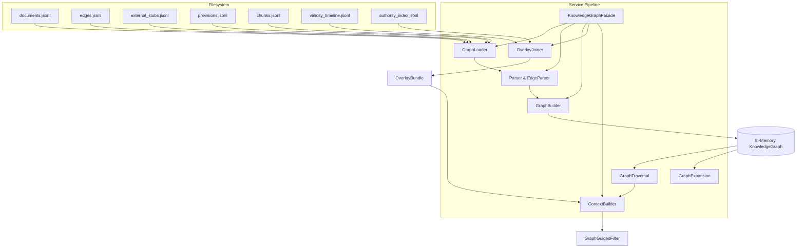

# G-LRAG v2 Knowledge Graph Module Specification

The Knowledge Graph module for G-LRAG v2 provides structural traversal, reading-order context expansion, and dynamic temporal/authority overlays to guide legal information retrieval and answer generation.

---

## 1. Overview

The module parses Layer 1 (Normalized) and Layer 2 (Structured) v2 datasets, structures them in-memory as a directed property graph, and applies dynamic Layer 3 (Derived) overlays at query time to filter and context-expand vector search operations.

### Key Objectives
* Establish a unified identity namespace mapping `Document` $\rightarrow$ `Provision` $\rightarrow$ `Chunk`.
* Filter vector queries using dynamic overlays based on publication dates, validity timelines, and legal authority rankings.
* Restore original clause reading order through Graph Expansion, sliding windows of chunks, and walking provision adjacency chains.

---

## 2. Architecture

The module utilizes a decoupled service pipeline to separate concerns and prevent vector or text-processing logic from bloating the graph representation.



* **Loader Layer:** Coordinates file reads. Excludes quarantine files to protect database integrity.
* **Parser Layer:** Maps raw JSON lines to typed dataclass nodes and canonical edge records.
* **Build Layer:** Establishes uniqueness constraints and materializes internal containment and reading-order links.
* **Overlay Layer:** Chronologically folds validity events and resolves legal ranks dynamically without mutating base graph nodes.
* **Reasoning/Retrieval Layer:** Walks BFS paths, applies query constraints, whitelists document IDs, and expands vector hits.

---

## 3. Folder Structure

```text
src/knowledge_graph/
├── __init__.py           # Exports public facades, schemas, and helpers
├── builder.py            # Materializes structural links and reading order
├── context.py            # Computes GraphGuidedFilter whitelist candidates
├── context_schema.py     # Value types for whitelists and filters
├── edge_parser.py        # Edge normalization and verification gating
├── edge_schema.py        # GraphEdge structure
├── expansion.py          # Horizontally expands seed chunks in reading order
├── expansion_schema.py   # Value types for expansion results and steps
├── facade.py             # Public unified coordination boundary
├── loader.py             # File stream loader
├── overlay.py            # dynamic validity timeline folder and rank resolver
├── overlay_schema.py     # Value types for overlays and timeline events
├── parser.py             # Node parsers and provenance joiner
├── schema.py             # Core node models (Document, Provision, Chunk, Stub)
└── utils.py              # Consolidated string, boolean, and flag helpers
```

---

## 4. Data Model

The graph utilizes a structured schema matching the upstream structuring pipeline:

### 4.1 Node Labels

1. **`Document`:** Holds normalized metadata, citation labels, and extraction status.
2. **`Document:ExternalStub`:** Represents referenced documents missing from the corpus. citation_safe is forced to `False`.
3. **`Provision`:** Represents structural clauses (e.g., Articles or Preambles). Holds headings and character offsets. Does not store body text.
4. **`Chunk`:** Slim retrieval pointer node containing order indexes and sibling splits. Does not copy body text.

### 4.2 Edge Types

* **`DOCUMENT_HAS_PROVISION`** `(Document) -> (Provision)`: Contains containment relationships.
* **`PROVISION_HAS_CHUNK`** `(Provision) -> (Chunk)`: Links provisions to vector pointers.
* **`CHUNK_NEXT`** `(Chunk) -> (Chunk)`: Connects adjacent chunks within the same provision.
* **`PROVISION_NEXT`** `(Provision) -> (Provision)`: Connects adjacent provisions within a document.
* **`Cross-Document Edge`** `(Document) -> (Document)`: Maps relationship categories such as `BASED_ON`, `CITES`, `GUIDES_OR_DETAILS`, `REPLACES`, `AMENDS`, etc.

---

## 5. Graph Construction

The `GraphBuilder` is an in-memory graph factory:
1. **Uniqueness Gating:** Verifies that document `id_str`, provision `unit_id`, and chunk `chunk_id` are unique. Raises a `ValueError` on duplicates.
2. **Containment Mapping:** Joins provisions to documents via `id_str` and chunks to provisions via `parent_unit_id`. Logs missing parent links as warnings.
3. **Reading-Order Materialization:**
   - Sorts provisions per document using `char_start` and connects them via `PROVISION_NEXT`.
   - Sorts chunks per provision using `chunk_index_in_unit` and connects them via `CHUNK_NEXT`.

---

## 6. Traversal

Path traversal is executed by `GraphTraversal`. It traverses cross-document edges only where `direction_verified == True`. Unverified edge groups (such as `validity` and `suspension` groups) are excluded during path queries to maintain reasoning integrity.

### Traversal Modes
* **`basis`:** Follows verified `BASED_ON` edges. Capped at a depth of 3.
* **`guidance`:** Explores implementing Circulars or Decrees mapped to general Laws.
* **`validity`:** Traces replacements and amendments to map document lineage.
* **`structure`:** Walks internal containment hierarchies.
* **`neighbors`:** Returns all outgoing cross-document links.

---

## 7. Expansion

`GraphExpansion` takes seed chunk hits from vector search and expands them into a contiguous reading-order chunk window.

```text
Seed Chunk ──▶ Get Parent Provision ──▶ Slice Sibling Window ──▶ Walk PROVISION_NEXT ──▶ Dedup Context List
```

1. **Provision Windowing:** Slices adjacent sibling chunks within the seed chunk's parent provision using `chunk_index_in_unit` to center the window.
2. **Horizontal Walk:** Follows `PROVISION_NEXT` forward within a `max_hop` budget to append subsequent provisions' chunks in natural reading order.
3. **Deduplication:** Dedupes and caps the resulting chunk ID list to `max_context`.

---

## 8. Overlay Filtering

Validity status and legal authority ranks are resolved dynamically at query time:
* **dynamic Currency Folding:** `compute_currency_status` folds validity events up to a query-time `as_of_date`. Events derived from unverified edges are excluded.
* **Precedence Resolution:** Ranks document types (e.g. Constitution = 1, Law = 2). Tie-breaks matching ranks by selecting the newer effective date / version.
* **Filter whitelist:** Evaluates queries against validity profiles (`current_law`, `broad`, `historical`) and whitelists candidate IDs.

---

## 9. Context Builder

`ContextBuilder` acts as the query planner. It:
1. Gathers visited IDs from `GraphTraversal`.
2. Intersects candidate IDs with the validity states in `OverlayBundle`.
3. Filters IDs using `QueryConstraints` (e.g. publication year ranges, whitelisted issuers).
4. Emits a `GraphGuidedFilter` document ID whitelist. Surfaces warnings explicitly if the candidate set is empty.

---

## 10. Integration with Retrieval

Integration with [src/retrieval/retriever.py](file:///d:/HK3_3/Text%20Mining/TextMining/src/retrieval/retriever.py) is kept decoupled:
1. **Filter integration:** The client uses the graph module to resolve query terms $\rightarrow$ traversals $\rightarrow$ dynamic overlays $\rightarrow$ Whitelist IDs.
2. **Vector Filtering:** Whitelist IDs are passed to the retriever as the `id_str_filter` argument.
3. **Retrieval Expansion:** Retrieved vector search hits are expanded using `GraphExpansion` to append sibling chunks before ranking.

---

## 11. Public APIs

### `KnowledgeGraphFacade`
Exposes the main entry points:
* `build_graph() -> GraphBuildResult`: Loads final files and builds the graph.
* `traverse(graph, start_id, mode, max_depth) -> TraversalResult`: Resolves path queries.
* `build_overlay_bundle(documents, events, entries, as_of_date) -> OverlayBundle`: Calculates document validity.
* `build_graph_guided_filter(...) -> GraphGuidedFilter`: Builds whitelist filters for retrieval.
* `build_evidence_context(...) -> EvidenceContext`: Formulates the final evidence context for the SLM.
