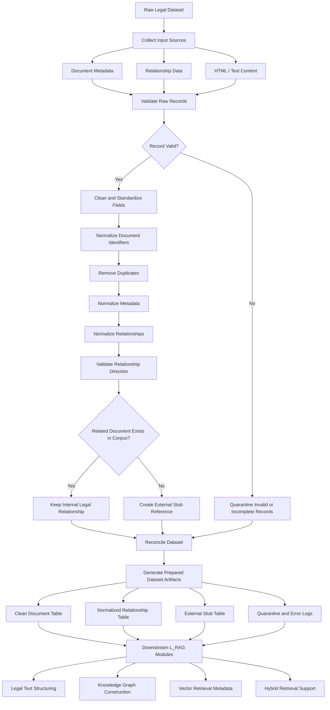

# Dataset Design and Preparation Flowchart

This single flowchart summarizes the Dataset Design and Preparation process for Section 3 of the L_RAG report.

```mermaid
flowchart TD
    A[Raw Legal Dataset] --> B[Collect Input Sources]

    B --> B1[Document Metadata]
    B --> B2[Relationship Data]
    B --> B3[HTML / Text Content]

    B1 --> C[Validate Raw Records]
    B2 --> C
    B3 --> C

    C --> D{Record Valid?}
    D -- No --> Q[Quarantine Invalid or Incomplete Records]
    D -- Yes --> E[Clean and Standardize Fields]

    E --> F[Normalize Document Identifiers]
    F --> G[Remove Duplicates]
    G --> H[Normalize Metadata]

    H --> I[Normalize Relationships]
    I --> J[Validate Relationship Direction]
    J --> K{Related Document Exists in Corpus?}

    K -- Yes --> L[Keep Internal Legal Relationship]
    K -- No --> M[Create External Stub Reference]

    L --> N[Reconcile Dataset]
    M --> N
    Q --> N

    N --> O[Generate Prepared Dataset Artifacts]

    O --> O1[Clean Document Table]
    O --> O2[Normalized Relationship Table]
    O --> O3[External Stub Table]
    O --> O4[Quarantine and Error Logs]

    O1 --> P[Downstream L_RAG Modules]
    O2 --> P
    O3 --> P
    O4 --> P

    P --> P1[Legal Text Structuring]
    P --> P2[Knowledge Graph Construction]
    P --> P3[Vector Retrieval Metadata]
    P --> P4[Hybrid Retrieval Support]
```
