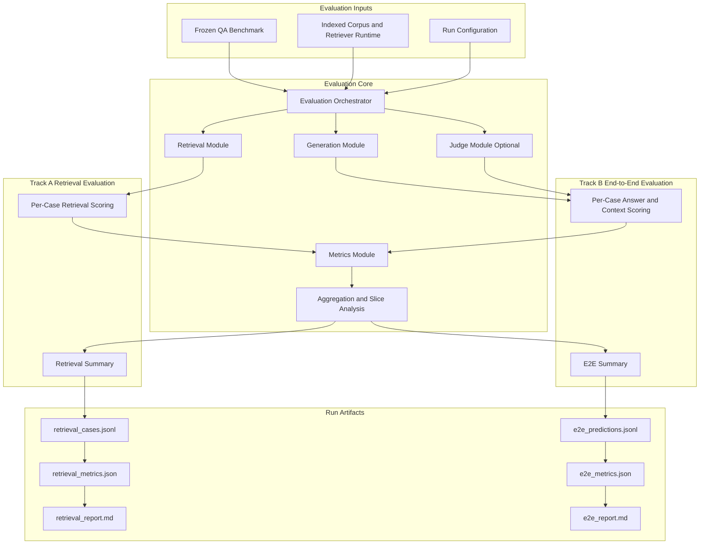

# G-LRAG v2 Evaluation Module Specification

The Evaluation module for G-LRAG v2 provides reproducible benchmark execution for retrieval-only and end-to-end RAG quality over a frozen QA dataset.

---

## 1. Overview

The module evaluates two distinct quality layers:

1. Retrieval quality: whether the retriever returns the minimal supporting chunk evidence.
2. End-to-end RAG quality: whether generated answers are correct, grounded, and robust for answerable and unanswerable questions.

### Key Objectives

- Standardize benchmark execution using a frozen QA JSONL input and deterministic run artifacts.
- Report retrieval metrics across top-k cutoffs and dataset slices (category, difficulty, answer type).
- Report end-to-end answer metrics with optional LLM-based judging for correctness, faithfulness, and relevancy.
- Keep evaluation code independent from indexing/build pipelines, while reusing the production retriever interface.

---

## 2. Architecture

The module is organized as major evaluation modules with shared infrastructure and two execution paths.



- Evaluation Inputs: frozen benchmark data, retriever-backed indexed corpus, and run-time settings.
- Evaluation Core: orchestration, retrieval, generation, optional judging, metrics, and aggregation.
- Track A (Retrieval): evaluates evidence-finding quality independent of generation.
- Track B (End-to-End): evaluates answer quality and grounding using retrieved context.
- Run Artifacts: machine-readable case files, aggregated metrics, and human-readable reports.

---

## 3. Folder Structure

```text
src/evaluation/
├── __init__.py            # Package boundary
├── io_utils.py            # JSONL/JSON IO and QA ID helper
├── metrics.py             # Retrieval and answer-level metric implementations
└── retriever_factory.py   # Runtime config and VectorRetriever constructor

scripts/
├── evaluate_retrieval.py  # Retrieval-only benchmark CLI
└── evaluate_e2e.py        # End-to-end benchmark CLI

tests/
└── test_evaluation_metrics.py  # Unit tests for metric behavior
```

---

## 4. Data Contract

### 4.1 Benchmark Input

Primary input is a frozen QA JSONL file containing question, answer metadata, and ground truth evidence:

```text
qa_id, question, category, difficulty, answer_type,
reference_answer or answer,
ground_truth.document_ids, ground_truth.provision_ids, ground_truth.chunk_ids
```

### 4.2 Evaluation Units

- Retrieval evaluation unit: one answerable QA with non-empty ground_truth.chunk_ids.
- End-to-end evaluation unit: one QA row, including unanswerable cases.

### 4.3 Runtime Dependencies

- Prebuilt vector collection (default: legal_chunks) served by Qdrant.
- Embedding model configuration matching indexed vectors (default: intfloat/multilingual-e5-large).
- Optional Gemini API key for generation and/or judge scoring.

---

## 5. Retrieval Evaluation Pipeline

CLI entry point: scripts/evaluate_retrieval.py

### 5.1 Execution Flow

1. Parse CLI arguments (qa path, out dir, top-k list, filter profile, store/model config).
2. Build VectorRetriever through RetrieverRuntimeConfig.
3. Stream QA rows from JSONL.
4. Skip unanswerable rows and rows missing ground truth chunk IDs.
5. Retrieve top results and compute per-case retrieval metrics.
6. Aggregate overall and by category, difficulty, and answer type.
7. Write case-level JSONL, summary JSON, and markdown report.

### 5.2 Retrieval Metrics

For each k in top-k list:

- recall@k
- hit@k
- mrr@k
- ndcg@k
- jaccard@k

### 5.3 Retrieval Outputs

- retrieval_cases.jsonl: per-case retrieved IDs, metadata, and per-k metrics.
- retrieval_metrics.json: aggregate summary and grouped breakdowns.
- retrieval_report.md: human-readable metric tables.

---

## 6. End-to-End Evaluation Pipeline

CLI entry point: scripts/evaluate_e2e.py

### 6.1 Execution Flow

1. Parse retrieval, generation, and judge runtime arguments.
2. Build VectorRetriever.
3. For each QA row, retrieve context chunks using configured filter profile and top-k.
4. Generate prediction:
   - reference mode: prediction equals reference answer (smoke path).
   - gemini mode: prediction from prompted Gemini model with retrieved context.
5. Compute automatic answer metrics and context recall against ground truth chunk IDs.
6. Optionally run Gemini judge and append judge-based metrics.
7. Write predictions JSONL, summary JSON, and markdown report.

### 6.2 Automatic E2E Metrics

- exact_match
- token_f1
- rouge_l
- unanswerable_accuracy
- context_recall@k

Optional judge metrics:

- judge_correctness
- judge_faithfulness
- judge_answer_relevancy

### 6.3 E2E Outputs

- e2e_predictions.jsonl: prediction, retrieved context, and per-case metrics.
- e2e_metrics.json: aggregate summary and grouped breakdowns.
- e2e_report.md: human-readable metric tables.

---

## 7. Shared Metric Implementations

Core metric logic is implemented in src/evaluation/metrics.py:

- Text normalization and tokenization:
  - Unicode NFC normalization
  - lowercasing
  - punctuation stripping
  - whitespace collapsing
- Answer metrics:
  - exact_match
  - token_f1
  - rouge_l using token-level LCS
- Retrieval metrics:
  - recall_at_k
  - hit_at_k
  - mrr_at_k
  - ndcg_at_k
  - jaccard_at_k
- Aggregation helpers:
  - aggregate
  - aggregate_by
- Unanswerable marker detection:
  - is_unanswerable_text (Vietnamese negative-evidence phrase markers)

Unit tests in tests/test_evaluation_metrics.py validate normalization and retrieval-rank behavior.

---

## 8. Retriever Integration Contract

The evaluation module does not implement retrieval logic. It delegates retrieval to the production retriever surface via src/evaluation/retriever_factory.py.

### 8.1 Runtime Config

RetrieverRuntimeConfig includes:

- store (default qdrant)
- qdrant_url
- qdrant_api_key
- collection_name
- model
- dev_hashing
- top_k, top_n
- score_threshold
- expand_units

### 8.2 Build Behavior

- Uses SentenceTransformerEmbedder by default.
- Uses HashingEmbedder only when dev_hashing is true.
- Enforces Qdrant store for CLI evaluation runs.

---

## 9. Reporting and Reproducibility

Each run should persist:

- Input benchmark path
- Retrieval and generation model configuration
- Filter profile and top-k settings
- Store endpoint and collection
- Case counts (evaluated, skipped)
- Aggregate and slice-level metrics

Recommended run metadata to persist externally with artifacts:

- corpus_version
- benchmark_version
- run timestamp
- git commit hash

---

## 10. Operational Guidance

### 10.1 Preconditions

- Vector index is built and loaded to target collection.
- Qdrant endpoint is reachable.
- QA benchmark file is frozen and schema-valid.
- Gemini key is available when using gemini generator or judge.

### 10.2 Interpretation Heuristics

- Low recall@k with low context_recall@k: retrieval/index/filter issue.
- High context_recall@k but low token_f1/rouge_l: generation/prompt issue.
- Low unanswerable_accuracy: overconfident answering beyond context.

---

## 11. Public CLI Surfaces

### Retrieval Evaluation

```bash
python scripts/evaluate_retrieval.py \
  --qa-path <path/to/qa.jsonl> \
  --out-dir evaluation_runs/retrieval \
  --top-k 1 5 10 \
  --filter-profile broad
```

### End-to-End Evaluation

```bash
python scripts/evaluate_e2e.py \
  --qa-path <path/to/qa.jsonl> \
  --out-dir evaluation_runs/e2e \
  --retrieval-top-k 10 \
  --filter-profile broad \
  --generator gemini \
  --generator-model gemini-3.1-flash-lite
```

---

## 12. Scope Boundaries

In scope:

- Benchmark execution
- Metric computation
- Aggregation and report artifact generation

Out of scope:

- Benchmark construction and QA synthesis
- Vector index building
- Knowledge graph traversal/overlay computation
- Online serving and UI concerns
