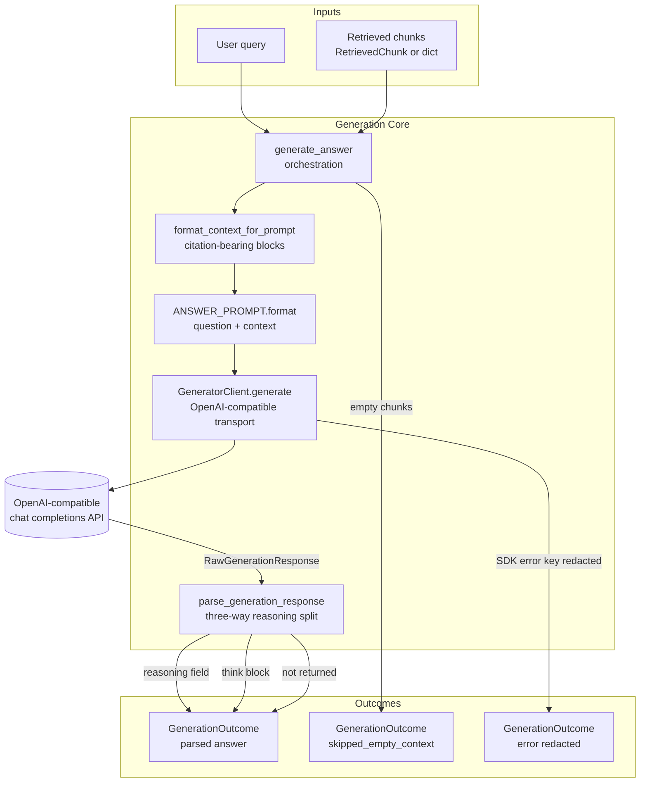

# G-LRAG v2 Generation Module Specification

The Generation module for G-LRAG v2 turns citation-ready retrieved chunks into grounded Vietnamese legal answers using any OpenAI-compatible, reasoning-capable chat completions endpoint.

---

## 1. Overview

The module consumes citation-ready evidence produced by the Retrieve module (baseline vector hits or hybrid graph-expanded chunks), builds a citation-bearing context, prompts the SLM, and splits the raw response into a final answer and its reasoning trace.

### Key Objectives

* Ground answers strictly in the retrieved CONTEXT: no speculation, no invented content, and a fixed abstention phrase when evidence is insufficient.
* Preserve citations end-to-end: context blocks are labeled with citation anchors and the prompt instructs the model to state its legal basis (citation) in the final answer.
* Support reasoning-capable models through a three-way reasoning extraction contract (dedicated field, `<think>` block, or "not returned").
* Never leak credentials: API keys are masked for display and redacted from error strings.
* Remain fully unit-testable offline; degrade gracefully on empty context, missing configuration, or API failure.

---

## 2. Architecture

The module is a thin, single-file pipeline with no build-time state. Prompt construction, context formatting, transport, and response parsing are separated behind small pure functions so every stage except the network call is testable without live API access.



* **Prompt Layer:** Owns `ANSWER_PROMPT`, the Vietnamese legal RAG template with `{question}` and `{context}` placeholders.
* **Context Layer:** `format_context_for_prompt` renders retrieved chunks into numbered, citation-labeled evidence blocks.
* **Client Layer:** `GeneratorClient` wraps the `openai` SDK chat completions surface with deterministic defaults and secret hygiene.
* **Parsing Layer:** `parse_generation_response` normalizes the three supported reasoning response shapes into one `ParsedAnswer` contract.
* **Orchestration Layer:** `generate_answer` wires the layers together and maps every path (success, skip, misconfiguration, failure) onto a single `GenerationOutcome` value.

---

## 3. Folder Structure

```text
src/generation/
├── __init__.py          # Package boundary; re-exports public API
└── reasoning_client.py  # Config, client, prompt, parsing, orchestration

tests/generation/
└── test_reasoning_client.py  # Offline unit tests (9 tests, no live network)
```

---

## 4. Data Model

All schemas are frozen dataclasses; no mutable state crosses function boundaries.

### 4.1 `GeneratorConfig`

Connection settings for an OpenAI-compatible endpoint:

```text
GeneratorConfig(
  base_url   = endpoint base URL,
  api_key    = raw API key (never logged),
  model_name = deployed model identifier
)
```

* `is_complete() -> bool`: true only when all three fields are non-empty.
* `masked_key() -> str`: `sk-a...mnop` form for keys longer than 8 characters, otherwise `***`. Safe for logs and UI display.

### 4.2 `RawGenerationResponse`

Transport-level result returned by `GeneratorClient.generate`:

```text
RawGenerationResponse(
  content         = stripped message content,
  reasoning_field = dedicated reasoning string, or None
)
```

### 4.3 `ParsedAnswer`

Normalized answer/reasoning split:

```text
ParsedAnswer(
  answer              = final answer text,
  reasoning           = reasoning trace, or None,
  reasoning_available = bool,
  reasoning_source    = "field" | "think_block" | "not_returned"
)
```

### 4.4 `GenerationOutcome`

Terminal state of one generation attempt:

```text
GenerationOutcome(
  qa_id                 = benchmark case ID, or None,
  parsed                = ParsedAnswer on success, or None,
  skipped_empty_context = True only for the empty-evidence path,
  error                 = redacted error string, or None
)
```

### 4.5 Input Contract

`generate_answer` and `format_context_for_prompt` accept any sequence of chunk-like values — attribute objects or dicts — exposing:

```text
citation_anchor, citation_label, chunk_id, title, chunk_text
```

This contract is satisfied by `RetrievedChunk` from `src/retrieval/schema.py`; dicts with the same keys are accepted for notebook and test convenience.

---

## 5. Prompt Contract

`ANSWER_PROMPT` is a fixed Vietnamese legal RAG template. Its rules, in order:

1. Answer **only** from the supplied CONTEXT; do not infer or invent beyond it.
2. If CONTEXT is insufficient, reply exactly: `"Không có đủ thông tin trong ngữ cảnh được cung cấp."`
3. Present the reasoning process first, then the final answer.
4. Write the final answer in Vietnamese with diacritics, including the legal basis (citation) when present in CONTEXT.

Placeholders: `{question}` for the user query and `{context}` for the formatted evidence blocks.

---

## 6. Context Formatting

`format_context_for_prompt` renders each chunk as:

```text
[rank] citation - title
chunk_text
```

Blocks are numbered from 1 in retrieval rank order and joined with blank lines.

Citation label fallback chain:

```text
citation_anchor → citation_label → chunk_id → "chunk-{rank}"
```

Design rules:

1. **Citation-first layout:** the label precedes the body so the model can attribute statements to `Điều`-level anchors without reading to the end of the block.
2. **Never emit an unlabeled block:** the fallback chain guarantees every block carries some stable identifier.
3. **Clean text only:** chunks contribute `chunk_text`; retrieval-time wrapper strings (identity headers) are not forwarded to the generator.

---

## 7. Response Parsing

`parse_generation_response` normalizes provider-specific reasoning shapes with strict precedence:

1. **Dedicated field:** non-empty `reasoning_content` or `reasoning` attribute/key on the response message → `reasoning_source="field"`; the field is never copied into the answer.
2. **Think block:** every `<think>...</think>` match (case-insensitive, DOTALL) is removed from the final answer → `reasoning_source="think_block"`.
3. **Not returned:** neither shape present → `reasoning=None`, `reasoning_source="not_returned"`, full content is the answer.

For an unterminated `<think>` tag, only content after an explicit final-answer marker is retained. Without such a marker, the unsafe remainder is discarded rather than exposed in evaluation or UI artifacts.

---

## 8. Client Behavior and Security

`GeneratorClient` wraps any OpenAI-compatible chat completions API:

* **Lazy SDK import:** `openai` is imported inside the constructor; a missing package raises a `RuntimeError` with an actionable `pip install openai` message.
* **Deterministic default:** temperature, top-p, token limit, timeout, and retry count have explicit defaults and can be frozen by an ablation config.
* **Reasoning capture:** both object-attribute and dict-style messages are inspected for dedicated reasoning fields.
* **Secret hygiene:** the raw API key is held only to redact SDK errors. On failure, the client raises `RuntimeError("Generator call failed: ...")` with every occurrence of the raw key replaced by `***`. Key material never propagates into `GenerationOutcome.error` either.

---

## 9. Runtime Configuration

The generator is configured entirely through environment-provided settings:

```text
LLM_BASE_URL      # OpenAI-compatible endpoint base URL
LLM_API_KEY       # endpoint credential
LLM_MODEL_NAME    # deployed model name
```

* An unconfigured generator (`client=None`) is **not** an exception: `generate_answer` returns a `GenerationOutcome` whose `error` names the three missing variables.
* The Colab runtime (`src/retrieval/colab_runtime.py`) treats the generator as a deferred, optional component: the load plan marks it `"optional remote API; env-based credentials"`, and `ResidentComponentSnapshot.generator_configured` surfaces readiness.
* `RuntimeProfile.use_hybrid_evidence_for_generation` selects whether the prompt context is built from hybrid-expanded evidence or seed-only vector hits.

---

## 10. Orchestration Flow

`generate_answer(client, query, chunks, qa_id=None, temperature=0.0)` maps every attempt onto exactly one outcome state:

| Condition                    | `parsed`       | `skipped_empty_context` | `error`                  |
| ---------------------------- | -------------- | ----------------------- | ------------------------ |
| `chunks` empty               | `None`         | `True`                  | `None`                   |
| `client is None`             | `None`         | `False`                 | configuration message    |
| generation succeeds          | `ParsedAnswer` | `False`                 | `None`                   |
| API or formatting exception  | `None`         | `False`                 | redacted error string    |

The empty-context check runs **before** any client interaction, so a missing or unconfigured generator is never the reason an unanswerable case fails.

---

## 11. Integration with Retrieval and Evaluation

The module depends on retrieval output but not on retrieval or graph internals:

1. **Citation handoff:** the Retrieve module guarantees every returned chunk carries `citation_anchor` plus document/provision metadata (see `RETRIEVE_MODULE.md` §13); the Generation module renders those fields verbatim into context blocks.
2. **Evidence selection:** callers choose baseline or hybrid-expanded chunk lists; the module is agnostic to how the list was produced.
3. **End-to-end evaluation:** the Evaluation module's Track B drives this client over frozen QA rows, using `qa_id` pass-through and `GenerationOutcome` states for per-case accounting (see `EVALUATION_MODULE.md` §6).
4. **Notebook demos:** the FAISS hybrid notebooks run generation as an optional final stage, enabled only when the env credentials in §9 are present.

---

## 12. Public APIs

### `GeneratorClient`

```python
GeneratorClient(*, base_url: str, api_key: str, model: str)
generate(
    prompt: str,
    *,
    temperature: float = 0.0,
    top_p: float = 1.0,
    max_output_tokens: int = 1024,
    timeout_seconds: float = 60.0,
    max_retries: int = 0,
) -> RawGenerationResponse
```

### Orchestration and helpers

```python
generate_answer(
    client: GeneratorClient | None,
    query: str,
    chunks: Sequence[Any],
    *,
    qa_id: str | None = None,
    temperature: float = 0.0,
    top_p: float = 1.0,
    max_output_tokens: int = 1024,
    timeout_seconds: float = 60.0,
    max_retries: int = 0,
    answer_type: str = "",
    prompt_strategy: PromptStrategy | str | None = None,
) -> GenerationOutcome

parse_generation_response(raw: RawGenerationResponse) -> ParsedAnswer

format_context_for_prompt(chunks: Sequence[Any]) -> str

build_generation_prompt(
    *,
    question: str,
    answer_type: str,
    context: str,
    strategy: PromptStrategy | str | None = None,
) -> str
```

### Constants and schemas

* **`ANSWER_PROMPT`:** Vietnamese legal RAG prompt template (§5).
* **`GeneratorConfig`, `RawGenerationResponse`, `ParsedAnswer`, `GenerationOutcome`:** frozen value types (§4).

All of the above are re-exported from `generation/__init__.py`.

---

## 13. Validation and Acceptance

The generation module should satisfy these acceptance conditions:

* All three reasoning response shapes (field, think block, not returned) parse correctly, including the unterminated-`<think>` edge case.
* Every formatted context block carries a non-empty citation label via the fallback chain.
* The abstention phrase and CONTEXT-only rules are present verbatim in `ANSWER_PROMPT`.
* Raw API keys never appear in `masked_key()` output, raised exceptions, or `GenerationOutcome.error`.
* Empty chunk lists short-circuit with `skipped_empty_context=True` and no API call.
* A `None` client yields a configuration error naming `LLM_BASE_URL`, `LLM_API_KEY`, `LLM_MODEL_NAME`.
* `tests/generation/test_reasoning_client.py` (9 tests) passes offline as part of the full project suite.

---

## 14. Scope Boundaries

In scope:

* Prompt construction and citation-bearing context formatting
* Single-turn answer generation over retrieved evidence
* Reasoning/answer parsing across supported provider shapes
* Failure capture and secret redaction

Out of scope:

* Citation-faithfulness verification — citations are prompt-encouraged; generated citation text is not parsed or checked against retrieved chunks
* Streaming responses, retries, and rate-limit handling
* Multi-turn dialogue state and query decomposition
* Answer-quality scoring, hallucination metrics, and judging (owned by the Evaluation module)
* Citation rendering in any user interface
