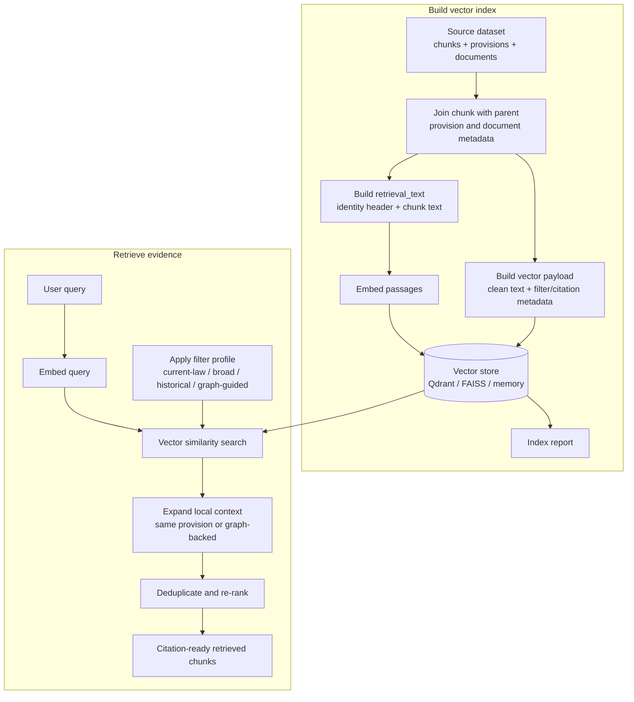

# G-LRAG v2 Retrieve Module Specification

The Retrieve module for G-LRAG v2 provides dense vector indexing, query-time metadata filtering, same-provision context expansion, and citation-ready chunk retrieval over the v2 legal corpus.

---

## 1. Overview

The module consumes Layer 1 (Normalized) and Layer 2 (Structured) v2 datasets, joins slim chunk rows to their parent provisions and documents, embeds an identity-aware retrieval text, and exposes a retrieval API for baseline and graph-guided RAG flows.

### Key Objectives
* Build `retrieval_text` at embed time from `Document` + `Provision` + `Chunk` instead of storing denormalized retrieval strings in `chunks.jsonl`.
* Store clean `chunk_text` and joined metadata as vector payload for LLM grounding, filtering, citations, and graph joins.
* Support current-law, broad, historical, and graph-guided filter profiles using validity, authority, facets, and `id_str` whitelists.
* Restore local context through same-provision or graph-backed expansion before re-ranking and final selection.

---

## 2. Architecture

The module uses a decoupled indexing and retrieval pipeline. Embedding, vector-store access, payload construction, filtering, expansion, and ranking are separated behind small interfaces so the same retrieval flow can target in-memory tests, Qdrant, or FAISS-backed local indexes.



* **Configuration Layer:** Defines dataset paths, collection settings, embedding model defaults, top-k/top-n values, and text-template versioning.
* **Text/Payload Layer:** Joins chunk, provision, and document rows to build the embedded text and vector payload.
* **Embedding Layer:** Encodes passages and queries with either production sentence-transformer models or deterministic hashing vectors for tests.
* **Store Layer:** Provides a common `VectorStore` contract over in-memory, Qdrant, and FAISS implementations.
* **Indexing/Loading Layer:** Builds vectors from source JSONL files or loads precomputed vector shards while enforcing duplicate and blacklist checks.
* **Retrieval Layer:** Embeds the query, applies filter profiles, searches the store, expands nearby context, re-ranks, deduplicates, and returns citation-ready chunks.

---

## 3. Folder Structure

```text
src/retrieval/
├── __init__.py          # Package boundary for retrieval components
├── build_vector_db.py   # Script/helper entry point for building vector stores
├── config.py            # VectorPaths and VectorIndexConfig defaults
├── embeddings.py        # Embedder interface, SentenceTransformerEmbedder, HashingEmbedder
├── faiss_store.py       # Persistent FAISS-backed VectorStore implementation
├── indexer.py           # Join-then-embed indexing pipeline and report writer
├── io_utils.py          # JSONL streaming, batching, and text cleanup helpers
├── retriever.py         # Public VectorRetriever query flow
├── schema.py            # RetrievalResult, RetrievedChunk, VectorRecord schemas
├── shard_loader.py      # Loader for precomputed vector shard directories
├── stores.py            # VectorStore interface, SearchHit, Qdrant, in-memory store
├── temp.py              # Temporary development scratch file
└── text_builder.py      # Retrieval text and payload construction
```

---

## 4. Data Model

The retrieve module indexes chunks as vector points and stores joined metadata as payload. The v2 chunk file remains slim; metadata is resolved by joining to provision and document records.

### 4.1 Source Inputs

1. **`chunks.jsonl`:** Supplies `chunk_id`, `parent_unit_id`, `id_str`, chunk ordering fields, `chunk_text`, length estimates, split flags, and structuring quality flags.
2. **`provisions.jsonl`:** Supplies `unit_type`, `article_number`, `unit_heading`, `path`, and `citation_anchor` by `unit_id`.
3. **`documents.jsonl`:** Supplies title, citation label, document type, validity group, authority rank, date fields, quality flags, and facet triples.
4. **`documents_quarantine.jsonl` / `external_stubs.jsonl`:** Define records that must never be loaded into the final vector index.
5. **Precomputed Shards:** Optional `vectors.npy` + `payloads.jsonl` + `meta.json` directories used when embeddings are produced outside the main indexing job.

### 4.2 Vector Point Contract

Each indexed chunk becomes a `VectorRecord`:

```text
VectorRecord(
  point_id = chunk_id,
  vector   = normalized dense embedding,
  payload  = joined retrieval payload
)
```

The vector is computed from `retrieval_text`; the payload stores clean display/grounding text and metadata. The module intentionally does not store `retrieval_text` because it is reproducible from the source joins and template version.

### 4.3 Payload Fields

Payloads include:

```text
chunk_id, parent_unit_id, id_str
chunk_index_in_unit, chunk_count_in_unit
chunk_text, chunk_char_count, chunk_token_estimate
unit_split, structuring_quality_flags
unit_type, article_number, unit_heading, path, citation_anchor
title, citation_label, so_ky_hieu, loai_van_ban
legal_authority_rank, validity_group, currency_hint
issuing_authority_code, issuing_authority_surface
legal_field_code, legal_field_surface
sector_code, sector_surface
scope_code, scope_surface
issue_year, ngay_ban_hanh_iso, ngay_co_hieu_luc_iso, ngay_het_hieu_luc_iso
quality_flags
```

### 4.4 Filterable Fields

The primary indexed filter fields are:

* `legal_authority_rank`
* `validity_group`
* `id_str`
* `unit_type`
* `loai_van_ban`
* `legal_field_code`
* `sector_code`
* `scope_code`
* `issuing_authority_code`
* `issue_year`
* `parent_unit_id` for same-provision expansion and scroll operations

---

## 5. Retrieval Text Construction

`text_builder.build_retrieval_text` creates the exact string embedded for each chunk:

```text
{document.title} | {document.citation_label} | {unit_ref} {unit_heading}
{chunk.chunk_text}
```

Where `unit_ref` is `Điều {article_number}` for article provisions and otherwise the provision `unit_type`.

Design rules:
1. **Embed identity + body:** The first line anchors the chunk to its document and parent legal unit; the second line is the substantive chunk text.
2. **Do not embed control metadata:** Authority rank, validity, currency, and rule-based facet codes remain payload fields, not semantic text.
3. **Version the template:** `VectorIndexConfig.retrieval_text_template_version` records the contract. Changing the template requires re-embedding.
4. **Store clean text:** The LLM receives `chunk_text`, citation metadata, and selected payload fields, not the retrieval wrapper.

---

## 6. Indexing

`VectorIndexer` builds the vector database from v2 JSONL sources:

1. **Input validation:** Confirms chunks, provisions, and documents files exist.
2. **Join maps:** Loads documents by `id_str` and provisions by `unit_id`.
3. **Collection setup:** Recreates the vector store collection when requested using the embedder dimension.
4. **Streaming batches:** Reads chunks in batches controlled by `VectorIndexConfig.batch_size`.
5. **Duplicate gating:** Tracks `chunk_id` values and skips duplicates while counting them in `IndexStats`.
6. **Join gating:** Skips chunks whose parent provision or document cannot be found and counts `join_misses`.
7. **Embedding:** Builds `retrieval_text`, encodes passages, and stores normalized vectors.
8. **Payload upsert:** Joins payload fields and upserts `VectorRecord` objects into the selected `VectorStore`.
9. **Reporting:** Writes `vector_index_report.md` with counts, token estimates, metadata distributions, and acceptance snapshots.

### Index Statistics

`IndexStats` tracks source/indexed/skipped chunk counts, duplicates, join misses, missing text/citations, validity/rank issues, unique documents/provisions, token estimates, metadata distributions, and elapsed time.

---

## 7. Embeddings and Vector Stores

### 7.1 Embedders

* **`SentenceTransformerEmbedder`:** Production encoder using `sentence-transformers`. It applies query and passage prefixes, normalizes embeddings, and exposes model name and vector dimension.
* **`HashingEmbedder`:** Deterministic lightweight encoder for tests and local smoke runs. It avoids model downloads while preserving the `Embedder` interface.

Default production configuration uses `intfloat/multilingual-e5-large` with `query: ` and `passage: ` prefixes.

### 7.2 VectorStore Implementations

* **`InMemoryVectorStore`:** Simple cosine-search store for tests and smoke indexing.
* **`QdrantVectorStore`:** Production-style adapter with payload indexes for authority, validity, document IDs, provision IDs, facets, document type, unit type, and issue year.
* **`FaissVectorStore`:** Local persistent FAISS index using inner product over normalized vectors, plus JSONL payload and ID-map persistence.

The shared `VectorStore` API exposes:

```python
recreate_collection(vector_size: int) -> None
upsert(records: list[VectorRecord]) -> None
search(vector, limit, score_threshold=None, filters=None) -> list[SearchHit]
scroll(filters: dict, limit: int) -> list[SearchHit]
```

---

## 8. Shard Loading

`ShardLoader` supports loading precomputed embedding shards into any `VectorStore`. Each shard directory contains:

```text
vectors.npy
payloads.jsonl
meta.json
```

The loader:
1. Discovers flat or partitioned shard layouts.
2. Reads shard metadata to determine vector dimension.
3. Optionally loads blacklist IDs from `documents_quarantine.jsonl` and `external_stubs.jsonl`.
4. Recreates the target collection if requested.
5. Upserts vectors and payloads in configurable batches.
6. Skips duplicate `chunk_id` records and blacklisted `id_str` records.
7. Tracks `LoadStats` including loaded/skipped records, duplicates, missing fields, filtered records, elapsed time, and errors.

---

## 9. Retrieval Flow

`VectorRetriever.retrieve` implements the baseline vector retrieval path:

```text
User Query ──▶ clean_text ──▶ query embedding ──▶ build filters ──▶ vector search
           ──▶ same-unit expansion ──▶ dedupe ──▶ metadata re-rank ──▶ top_n result
```

1. **Profile validation:** Ensures the requested filter profile is one of `current_law`, `broad`, `historical`, or `graph_guided`.
2. **Graph-guided override:** If a `GraphGuidedFilter` is supplied, its `id_strs` become the hard document whitelist and the profile becomes `graph_guided`.
3. **Empty whitelist handling:** Empty graph-guided filters return an empty `RetrievalResult` with `empty_filter_warning=True`; they do not silently fall back to unfiltered retrieval.
4. **Query encoding:** Cleans and embeds the query using the configured query encoder.
5. **Vector search:** Searches the configured `VectorStore` with top-k, score threshold, and metadata filters.
6. **Expansion:** Adds same-provision context using either `GraphExpansion` or local payload scrolling.
7. **Deduplication:** Deduplicates first by `chunk_id`, then by identical `chunk_text`, keeping the highest score.
8. **Re-ranking:** Applies soft authority, validity, structure, title/citation, and quality signals.
9. **Result shaping:** Returns `RetrievedChunk` objects plus candidate counts and warning flags.

---

## 10. Filter Profiles and Ranking

### 10.1 Filter Profiles

* **`current_law`:** `validity_group IN [active, partial, future]`.
* **`broad`:** `validity_group IN [active, partial, future, expired, unknown]`.
* **`historical`:** `validity_group IN [expired, active, partial]`.
* **`graph_guided`:** `id_str IN <graph-guided document whitelist>`.

Additional filters may be supplied through `extra_filters`, such as document type, facet code, authority range, unit type, or issue-year range.

### 10.2 Re-ranking Signals

The re-ranker starts from vector similarity and adjusts scores:

**Boosts**
* `legal_authority_rank <= 2`: `+0.10`
* `validity_group == active`: `+0.08`
* `unit_type == article`: `+0.05`
* Direct title or citation match in the query: `+0.10`

**Penalties**
* `legal_authority_rank >= 7` or unknown rank: `-0.05`
* `validity_group == expired` outside historical mode: `-0.08`
* `validity_group == unknown`: `-0.03`
* document `quality_flags`: `-0.05`
* `structuring_quality_flags`: `-0.02`

---

## 11. Context Expansion

The module supports two same-unit expansion paths:

1. **Graph-backed expansion:** If `GraphExpansion` is provided, the retriever expands seed chunk IDs through the knowledge graph and fetches the resulting chunk payloads from the vector store.
2. **Local payload expansion:** If no graph expansion service is configured, the retriever uses `parent_unit_id` and `chunk_index_in_unit` to scroll sibling chunks within a configurable window.

Expansion restores local article/provision context before final re-ranking. The expanded hit list is deduplicated so repeated chunk IDs and repeated text bodies do not crowd out diverse evidence.

---

## 12. Public APIs

### `VectorIndexer`

Main indexing entry points:

* `build(recreate=True, limit=None, write_report=True) -> IndexStats`: Builds vectors from joined JSONL sources.
* `write_report(stats) -> None`: Writes `vector_index_report.md`.

### `VectorRetriever`

Main retrieval entry point:

```python
retrieve(
    query: str,
    filter_profile: str = "current_law",
    id_str_filter: list[str] | None = None,
    graph_guided_filter: GraphGuidedFilter | None = None,
    top_k: int | None = None,
    top_n: int | None = None,
    score_threshold: float | None = None,
    expand_units: bool | None = None,
    extra_filters: dict[str, Any] | None = None,
) -> RetrievalResult
```

### `ShardLoader`

* `load_all(recreate=True, data_dir=None, limit=None) -> LoadStats`: Loads precomputed vector shards into a store.

### Schemas

* **`RetrievedChunk`:** Citation-ready retrieval unit with text, scores, document/provision IDs, validity, authority, and payload metadata.
* **`RetrievalResult`:** List of chunks, total vector candidates, filter profile used, and `empty_filter_warning`.
* **`VectorRecord`:** Store-ready vector point.
* **`SearchHit`:** Store-level hit with point ID, score, and payload.

---

## 13. Integration with Knowledge Graph and Generation

Integration with `src/knowledge_graph/` is explicit and optional:

1. **Graph-guided filtering:** The graph module can produce a `GraphGuidedFilter` containing allowed `id_str` values. Retrieval applies this as a hard vector-store filter.
2. **Currency overlays:** For authoritative as-of validity, the graph module should compute dynamic currency states and pass the resulting document whitelist to retrieval.
3. **Graph expansion:** The retriever can use `GraphExpansion` to expand vector seed chunks in reading order beyond local payload windowing.
4. **Citation handoff:** Retrieved chunks include `citation_anchor`, `citation_label`, title, article number, path, `id_str`, and `parent_unit_id` for generation and evidence formatting.

Generation should use `chunk_text` as grounded content and citation fields for display. Expired or low-authority chunks should be treated carefully according to the selected filter profile and user intent.

---

## 14. Validation and Acceptance

The retrieve module should satisfy these acceptance conditions:

* All non-quarantined chunks with successful provision/document joins are indexed.
* Duplicate `chunk_id` records are detected and excluded from indexing/loading.
* Join misses are counted and surfaced in the report.
* Every vector payload has non-empty `chunk_text` and `citation_anchor`.
* Every vector payload has valid `validity_group` and integer `legal_authority_rank`.
* Filterable payload fields are indexed or supported by the chosen store.
* The embedding model, vector dimension, distance metric, and retrieval text template version are recorded.
* Current-law, broad, historical, and graph-guided filters work consistently.
* Empty graph-guided filters return an explicit warning instead of unfiltered results.
* Same-unit expansion and deduplication run before final re-ranking.
* `RetrievalResult` provides citation-ready `RetrievedChunk` records for downstream generation.
